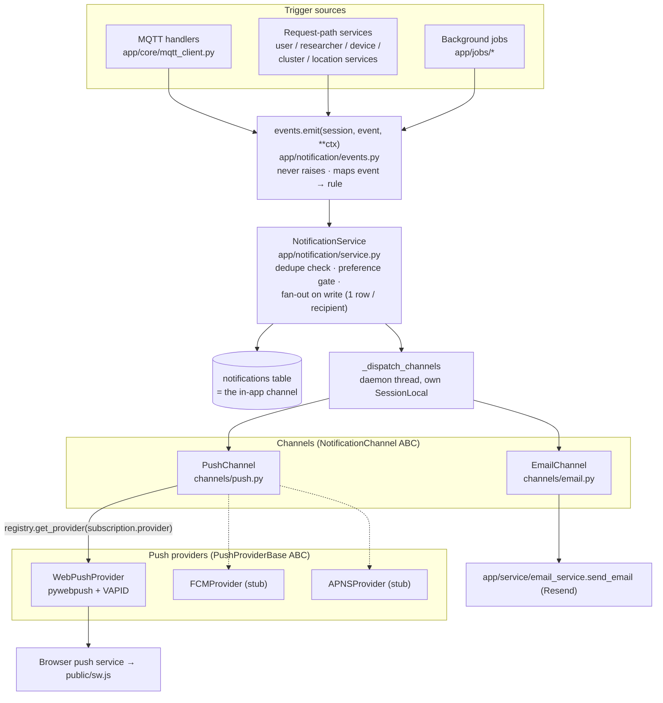

# Notification System — Architecture

How notifications flow from a trigger (MQTT message, API call, background job) to a user's
bell, browser push, or inbox. Everything here describes the code as shipped; where the
implementation deliberately deviates from `NOTIFICATIONS_PLAN.md`, the deviation is listed
in [Deviations from the plan](#deviations-from-the-plan).

Related docs: [DATABASE.md](DATABASE.md) · [EVENT_FLOWS.md](EVENT_FLOWS.md) ·
[API.md](API.md) · [DEVELOPER_GUIDE.md](DEVELOPER_GUIDE.md) · [DEPLOYMENT.md](DEPLOYMENT.md)

---

## 1. Component overview

Module map (all under `mosquito_dashboard_be/app/notification/` unless noted):

| Module | Responsibility |
|---|---|
| `enums.py` | `NotificationType` (29 members), `NotificationSeverity`, `NotificationCategory`, `PushProvider`, `DeliveryChannel`, `DeliveryStatus` |
| `models.py` | `Notification`, `PushSubscription`, `NotificationPreference`, `NotificationDelivery` |
| `events.py` | `NotificationEvent` enum + `emit()` + one handler per event (template, severity, recipients, dedupe, icon, action_url) |
| `service.py` | `NotificationService` — the single entry point: `send` / `send_bulk`, recipient resolution (`notify_user` / `notify_cluster` / `notify_admins` / `broadcast`), read-path methods, preferences, push subscriptions, cleanup, off-request channel dispatch |
| `repository/notification_repository.py` | All SQL: `NotificationRepository`, `PushSubscriptionRepository`, `NotificationPreferenceRepository`, `NotificationDeliveryRepository` |
| `channels/base.py` | `NotificationChannel` ABC (`send(notification, user) -> bool`, must never raise) |
| `channels/push.py` | Fans one notification out to every active subscription; `build_push_payload()` defines the JSON the service worker receives |
| `channels/email.py` | Branded HTML template + `EmailChannel`; reuses the existing Resend `send_email` |
| `providers/base.py` | `PushProviderBase` ABC + `PushResult` (`success`, `should_deactivate`, `error`) |
| `providers/registry.py` | `get_provider(PushProvider) -> provider or None` (unconfigured → `None`, logged once) |
| `providers/webpush.py` | Implemented provider (pywebpush + VAPID env vars) |
| `providers/fcm.py`, `providers/apns.py` | Registered stubs — `send()` raises `NotImplementedError` |
| `routes.py`, `push_routes.py` | The `/notifications` and `/push` routers (see [API.md](API.md)) |
| `app/jobs/*` (sibling package) | Scheduler + 6 background jobs (see [EVENT_FLOWS.md](EVENT_FLOWS.md) §jobs) |

Routers are registered in `app/core/main.py` with prefixes `/notifications` and `/push`;
the scheduler starts/stops in the same file's `lifespan`.

## 2. Design principles

| Principle | Where enforced | Effect |
|---|---|---|
| **Business logic never builds `Notification` rows** | `events.emit()` is the only call at trigger sites (one import, one line) | Trigger code stays one line; all templates/rules live in `events.py` |
| **`emit` never raises** | Blanket `try/except` inside `emit`; unknown events and missing handlers log a warning and return | A notification bug can never break MQTT ingestion or a request. `NOTIFY_ENABLED=0` short-circuits the whole system |
| **Fan-out on write** | `send_bulk` creates one `notifications` row per recipient at emit time | Reads are always `WHERE user_id = me` — no visibility joins, no cross-user leakage possible at read time |
| **Preference gating at creation** | `NotificationService._allowed_by_preferences` (the `PREFERENCE_GATES` map + `in_app_enabled` master switch) | A gated-off type creates **no row at all** for that user (not a hidden row); `push_enabled` / `email_enabled` additionally gate channel dispatch |
| **Dedupe windows** | `send`/`send_bulk` skip creation when a row with the same `dedupe_key` exists within `dedupe_window_minutes`; the lookup deliberately ignores read/archive/delete state | Alert storms (e.g. a low battery reported every 30 s) collapse to one notification per window; clearing a notification does not re-arm the throttle |
| **Off-request channel dispatch** | `_dispatch_channels` starts a daemon thread with its own `SessionLocal` (house pattern from `device_location_service._dispatch_geocode`) | Push/email network calls never block the MQTT loop or an HTTP request |
| **Delivery tracking** | One `notification_deliveries` row per (notification, channel) attempt, marked SENT/FAILED | Powers the push-retry job with exponential-ish backoff |
| **Ownership by 404** | `_get_owned_or_404` raises 404 (never 403) for another user's row | Existence of other users' notifications is never revealed |
| **Startup-safe config** | Every knob is `os.getenv` with a default | Missing env vars can never break startup; unset VAPID silently disables push |

Email is deliberately quiet: it auto-sends only for `DAILY_SUMMARY` / `WEEKLY_SUMMARY`
(`EMAIL_AUTO_TYPES`) or CRITICAL severity, and only when the user opted in via
`email_enabled` (default **off**).

## 3. Channel / provider abstraction

Two independent extension points:

- **Channel** = a transport for a notification (`channels/base.py::NotificationChannel`).
  In-app is not a channel class — it is the DB row itself (`send_in_app` just stamps
  `delivered_at`). PUSH and EMAIL are the current channel classes.
- **Push provider** = a backend for the PUSH channel, selected **per subscription** via
  `push_subscriptions.provider` (`providers/base.py::PushProviderBase`). WEBPUSH is
  implemented; FCM and APNS are registered stubs so mobile tokens can be stored today and
  delivered later.

### Adding a new channel (e.g. SMS or webhook)

1. Add the member to `DeliveryChannel` in `enums.py` (e.g. `SMS = "SMS"`) and to the
   `deliverychannel` PostgreSQL enum (new alembic migration — the type is created in
   migration `b8c9d0e1f2a3`).
2. Create `channels/sms.py` implementing `NotificationChannel.send(notification, user) -> bool`.
   The contract: return `True` on any successful delivery, catch everything, never raise.
3. Wire it in `service.py`: add a `send_sms()` method mirroring `send_push`/`send_email`
   (create the delivery row, call the channel, `mark_attempt`), decide its gating flag
   (add a `sms_enabled` preference — see [DEVELOPER_GUIDE.md](DEVELOPER_GUIDE.md)), and
   extend the `(notification_id, user_id, push, email)` tuples in `_dispatch_channels` /
   `_deliver_channels` with the new flag.
4. Trigger sites do not change — that is the point of the abstraction.

### Activating FCM / APNS

1. The enum member (`PushProvider.FCM` / `APNS`) and the DB enum values already exist.
2. Implement `send()` in `providers/fcm.py` / `providers/apns.py` (module docstrings spell
   out what each needs: firebase-admin for FCM HTTP v1; an APNs JWT client for Apple).
3. In `providers/registry.py::get_provider`, return a configured instance instead of
   falling through to the "registered but not configured" log. Include a config check like
   `is_webpush_configured()` so an unconfigured provider still resolves to `None`.
4. Clients register subscriptions with `"provider": "FCM"` (or `"APNS"`) on
   `POST /push/subscriptions`; `PushChannel` already routes per subscription and skips
   providers that resolve to `None`.

## 4. RBAC scoping (who receives what)

Recipients are resolved at **write** time in `service.py`; every read path is
`user_id = current_user.id AND deleted_at IS NULL`. Only **active** users are ever
targeted.

| Resolver | Recipients | Used by |
|---|---|---|
| `notify_cluster(cluster_id)` | users with `users.cluster_id = X` ∪ **all** SUPER_ADMINs (the deprecated `cluster_admins` M2M is deliberately excluded — stale rows there would leak another cluster's alerts). `cluster_id=None` (device without a cluster) → SUPER_ADMINs only. Public clusters do **not** broadcast to everyone | all device/sensor/mosquito/cluster events |
| `notify_admins()` | all SUPER_ADMINs | UNKNOWN_DEVICE, INVALID_PAYLOAD, USER_REGISTERED, RESEARCHER_REQUEST_SUBMITTED |
| `notify_user(user_id)` | exactly that user | account events, researcher decisions, summaries, TEST |
| `broadcast()` | every active user | defined, currently unused by any handler |
| summaries job (custom) | per cluster: members + cluster admins, **excluding** SUPER_ADMINs; SUPER_ADMINs get **one** global all-clusters summary instead (spam control) | DAILY_SUMMARY / WEEKLY_SUMMARY |

The full event → recipients matrix is in [EVENT_FLOWS.md](EVENT_FLOWS.md).

## 5. Deviations from the plan

Deliberate, or discovered during implementation — documented so the plan is not read as
ground truth:

| Plan said | Code does |
|---|---|
| FE dark mode via existing token strategy | **No `dark:` variants at all** — the app has zero dark-mode support (no toggle, no tokens); matching the real design system won over the spec bullet |
| `USER_APPROVED` / `USER_REJECTED` / `ROLE_CHANGED` fired from auth approve/reject/role flows | Handlers exist in `events.py` and the enum/DB values exist, but **no endpoint emits them** — there are no user-approval or role-change endpoints in the codebase yet. They are pre-wired for when those flows land |
| Summaries "per-user, driven by their preferences" | Summaries fan out **per cluster** (members + cluster admins), and SUPER_ADMINs receive **one global summary** across all devices instead of one per cluster |
| `VECTOR_SPECIES` map | `VECTOR_GENERA` set (`anopheles`, `aedes`, `culex`) — matching is genus-level, with the genus derived from the species' first word when the payload has no genus |
| `emit(NotificationEvent.X, **ctx)` | `emit(session, NotificationEvent.X, **ctx)` — the session is explicit so emit reuses the caller's transaction/session |
| Push/email/in-app all gated at "channel dispatch" | The five alert toggles and `in_app_enabled` gate **row creation**; only `push_enabled` / `email_enabled` gate dispatch |
| `NEXT_PUBLIC_VAPID_PUBLIC_KEY` optional FE env var | The FE never reads it — `GET /push/public-key` is the single source of truth for the VAPID key |
| Config list in plan §9 | Additional knobs exist for the job schedules (`NOTIFY_JOBS_ENABLED`, `NOTIFY_*_SEC`, `NOTIFY_DAILY_SUMMARY_UTC`, `NOTIFY_MAINTENANCE_DAYS`) and email links (`DASHBOARD_BASE_URL`) — full table in [DEPLOYMENT.md](DEPLOYMENT.md) |
| — | `PASSWORD_RESET` is emitted when a reset **is requested** (forgot-password OTP issued), not when the password is actually changed |
| Battery escalation threshold | The WARNING→CRITICAL escalation point (3.0 V) is the constant `BATTERY_URGENT_V`, not env-tunable; only the alert threshold (`NOTIFY_BATTERY_CRITICAL_V`, 3.3) is |
