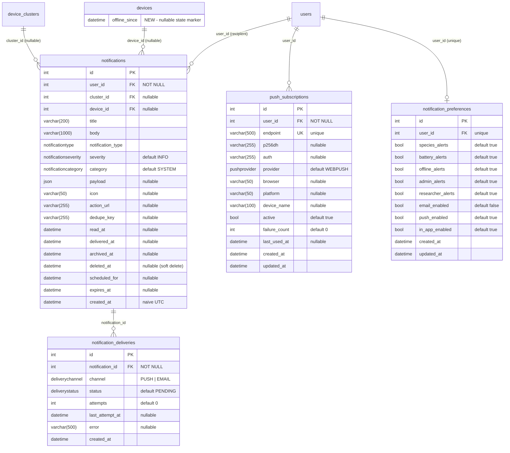

# Notification System — Database

Four new tables plus one new column on `devices`, added by migration
`alembic/versions/b8c9d0e1f2a3_add_notification_tables.py` (revises `a7b8c9d0e1f2`).
Models live in `app/notification/models.py`.

---

## 1. Entity-relationship diagram



## 2. Tables

### `notifications` — one row per recipient (fan-out on write)

| Column | Type | Null | Default | Notes |
|---|---|---|---|---|
| `id` | int PK | no | | |
| `user_id` | int FK `users.id` | no | | the recipient; every read is scoped to it |
| `cluster_id` | int FK `device_clusters.id` | yes | | scope context of the event |
| `device_id` | int FK `devices.id` | yes | | source device |
| `title` | varchar(200) | no | | service truncates to 200 |
| `body` | varchar(1000) | no | | service truncates to 1000 |
| `notification_type` | enum `notificationtype` | no | | 29 values, see `NotificationType` in `enums.py` |
| `severity` | enum `notificationseverity` | no | `'INFO'` | INFO / SUCCESS / WARNING / CRITICAL |
| `category` | enum `notificationcategory` | no | `'SYSTEM'` | MOSQUITO / SENSOR / DEVICE / ACCOUNT / RESEARCH / CLUSTER / SYSTEM |
| `payload` | JSON | yes | | structured context (species, voltage, uuid, …) |
| `icon` | varchar(50) | yes | | lucide icon name hint for the FE |
| `action_url` | varchar(255) | yes | | FE route, e.g. `/devices/42` |
| `dedupe_key` | varchar(255) | yes | | throttle key, e.g. `low_battery:42` |
| `read_at` | datetime | yes | | null = unread |
| `delivered_at` | datetime | yes | | stamped when the in-app row becomes visible |
| `archived_at` | datetime | yes | | null = active tab, set = archived tab |
| `deleted_at` | datetime | yes | | **soft delete** marker |
| `scheduled_for` | datetime | yes | | rows with `scheduled_for > now` are hidden until due |
| `expires_at` | datetime | yes | | hidden after expiry; hard-deleted by the cleanup job |
| `created_at` | datetime | no | `now()` (server) / `datetime.utcnow` (ORM) | **naive UTC** |

### `push_subscriptions` — one row per browser/device a user enabled push on

| Column | Type | Null | Default | Notes |
|---|---|---|---|---|
| `id` | int PK | no | | |
| `user_id` | int FK `users.id` | no | | a browser endpoint re-registered under another account **moves** to that user |
| `endpoint` | varchar(500) | no | | **unique** — the upsert key |
| `p256dh` | varchar(255) | yes | | client public key (Web Push encryption) |
| `auth` | varchar(255) | yes | | client auth secret |
| `provider` | enum `pushprovider` | no | `'WEBPUSH'` | WEBPUSH / FCM / APNS (FCM/APNS are stub providers) |
| `browser` / `platform` | varchar(50) | yes | | display metadata |
| `device_name` | varchar(100) | yes | | display metadata |
| `active` | bool | no | `true` | flipped off after 5 consecutive failures or a 404/410 from the push service; re-subscribing reactivates |
| `failure_count` | int | no | `0` | reset to 0 on success or re-subscribe |
| `last_used_at` | datetime | yes | | last successful delivery |
| `created_at` / `updated_at` | datetime | no | `now()` | |

### `notification_preferences` — per-user toggles, lazily created

One row per user, created with defaults on first read (`get_or_create`). All columns
`bool NOT NULL`; defaults **true except `email_enabled` (false)**:
`species_alerts`, `battery_alerts`, `offline_alerts`, `admin_alerts`,
`researcher_alerts`, `email_enabled` (false), `push_enabled`, `in_app_enabled`,
plus `created_at` / `updated_at`. `user_id` is FK `users.id` with a **unique** index.

### `notification_deliveries` — per-(notification, channel) attempt tracking

| Column | Type | Null | Default | Notes |
|---|---|---|---|---|
| `id` | int PK | no | | |
| `notification_id` | int FK `notifications.id` | no | | |
| `channel` | enum `deliverychannel` | no | | PUSH / EMAIL |
| `status` | enum `deliverystatus` | no | `'PENDING'` | PENDING / SENT / FAILED |
| `attempts` | int | no | `0` | retry job caps at 5 |
| `last_attempt_at` | datetime | yes | | drives the retry backoff |
| `error` | varchar(500) | yes | | truncated to 500 |
| `created_at` | datetime | no | `now()` | |

A delivery row is only created when there was something to deliver to (e.g. no PUSH row
is written for a user with zero active subscriptions — nothing to retry).

### `devices.offline_since` (new column)

`datetime NULL`. State marker owned exclusively by the offline-detection job: set when a
device is first flagged offline (exactly one DEVICE_OFFLINE per outage), cleared when
activity resumes (one DEVICE_ONLINE). Doubles as the "offline devices" counter input for
the summaries job.

## 3. Indexes and why each exists

All names as created by migration `b8c9d0e1f2a3`:

| Index | Columns | Why |
|---|---|---|
| `ix_notifications_user_id_created_at` | `(user_id, created_at)` | the hot list query: per-user, newest first (b-tree scans backwards for DESC) |
| `ix_notifications_user_id_read_at` | `(user_id, read_at)` | the unread badge (`read_at IS NULL` count per user, polled every 30 s per client) |
| `ix_notifications_dedupe_key_created_at` | `(dedupe_key, created_at)` | the dedupe-window lookup on every `send`/`send_bulk` |
| `ix_notifications_user_id` | `(user_id)` | FK/read-scope filter |
| `ix_notifications_cluster_id` / `ix_notifications_device_id` | single column | FK filters for future per-scope queries |
| `ix_notifications_dedupe_key` | `(dedupe_key)` | declared on the model column (`index=True`); superseded in practice by the composite above |
| `ix_notifications_id` (and each table's `ix_*_id`) | `(id)` | house convention — PK columns are declared `index=True` on every model |
| `ix_push_subscriptions_endpoint` | `(endpoint)` **UNIQUE** | the upsert key; one row per browser profile |
| `ix_push_subscriptions_user_id` | `(user_id)` | "all subscriptions for user" on every push delivery |
| `ix_notification_preferences_user_id` | `(user_id)` **UNIQUE** | one preference row per user; looked up on every send |
| `ix_notification_deliveries_notification_id` | `(notification_id)` | delivery rows per notification; the retry job filters status/attempts on top |

## 4. Soft-delete, expiry, scheduling semantics

Every read path shares one base filter (`NotificationRepository._visible_query`): mine,
`deleted_at IS NULL`, `scheduled_for IS NULL OR <= now`, `expires_at IS NULL OR > now`.

- **Soft delete**: `DELETE /notifications/{id}` sets `deleted_at`. The row disappears from
  every list/count immediately; the hourly cleanup job hard-deletes rows soft-deleted more
  than 30 days ago.
- **Expiry**: expired rows are hidden by the read filter immediately and hard-deleted by
  the cleanup job. Nothing currently sets `expires_at` at creation — the column is plumbed
  through `send`/`send_bulk` for future use.
- **Scheduling**: `scheduled_for` in the future hides the row and suppresses channel
  dispatch (`delivered_at` stays null; `_is_scheduled_future`). Once due, the row appears
  in lists. Also plumbed but not yet used by any handler.
- **Dedupe vs. state**: the dedupe lookup ignores read/archive/delete state on purpose —
  a user clearing a notification must not re-arm the throttle window.
- `mark_all_read` marks every visible unread row read, **including archived** ones;
  the unread badge (`unread_count`) counts unarchived rows only.

## 5. Migration

```bash
cd mosquito_dashboard_be
uv run alembic upgrade head
```

- Revision: `b8c9d0e1f2a3` (`add notification tables`), revises `a7b8c9d0e1f2` — the new
  head of the single linear chain.
- Creates six PostgreSQL enum types (`notificationseverity`, `notificationcategory`,
  `notificationtype`, `pushprovider`, `deliverychannel`, `deliverystatus`) with
  `checkfirst=True`, the four tables, all indexes, and `devices.offline_since`.
- Downgrade drops everything it created (column, tables, indexes, enum types).

**create_all dev caveat**: app startup runs `Base.metadata.create_all` (`create_tables()`
in `utils/init_db.py`), so on a dev database the tables may already exist before alembic
runs. The migration is **idempotent** for that case — every create is guarded with an
inspector check (`table_names` / `get_columns`), so `alembic upgrade head` still succeeds
and correctly stamps the version. Note that `create_all` never **alters** existing tables:
a database whose `devices` table predates this feature only gains `offline_since` through
the migration. Always run `alembic upgrade head` — `create_all` is a dev convenience, not
a substitute.
