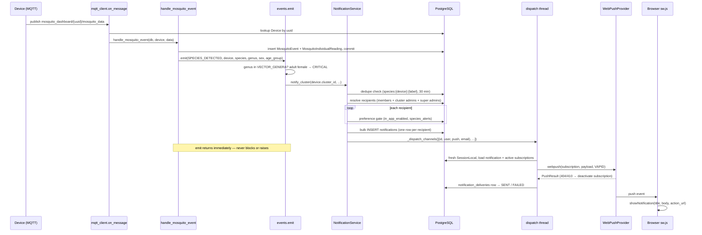
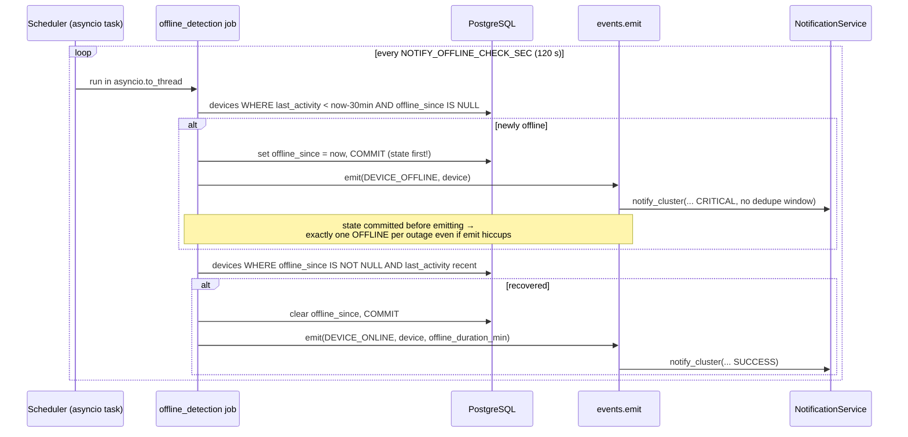
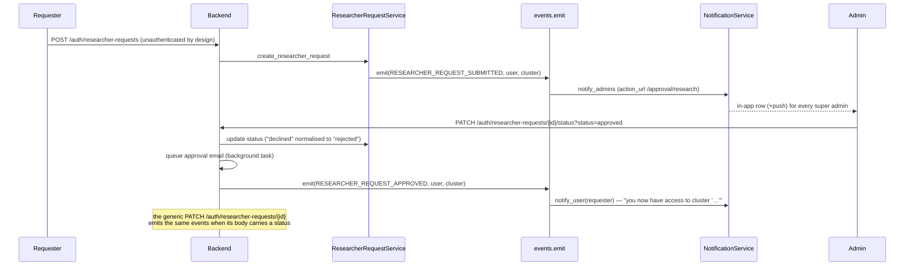

# Notification System — Event Flows

The trigger matrix as implemented, the `emit()` context contract per event, and sequence
diagrams for the four flows that cross the most components.

---

## 1. Trigger matrix (as implemented)

Legend: recipients per the resolvers in [ARCHITECTURE.md](ARCHITECTURE.md) §4 —
**cluster** = `notify_cluster` (cluster members + cluster admins + all super admins),
**admins** = `notify_admins` (super admins), **user** = `notify_user`.
Dedupe windows are minutes; "—" = no window (fires every time, or guarded elsewhere).

| Event | Emitted from | Fires when | Recipients | Severity | Dedupe (min) | Icon | action_url |
|---|---|---|---|---|---|---|---|
| `SPECIES_DETECTED` | `app/core/mqtt_client.py` (`handle_mosquito_event`) | detected genus ∈ {anopheles, aedes, culex} (genus falls back to first word of species); adult female escalates | cluster | WARNING / **CRITICAL** (adult ♀) | 30 per device+species label | `bug` | `/devices/{id}` |
| `ACTIVITY_SURGE` | `app/core/mqtt_client.py` (`handle_mosquito_event`, emitted on every event; handler counts) | > `NOTIFY_SURGE_THRESHOLD` (20) `MosquitoEvent`s in last `NOTIFY_SURGE_WINDOW_MIN` (60) for the device | cluster | WARNING | 120 per device | `bug` | `/devices/{id}` |
| `LOW_BATTERY` | `app/core/mqtt_client.py` (`handle_sensor_data`) | voltage < `NOTIFY_BATTERY_CRITICAL_V` (3.3); < 3.0 escalates | cluster | WARNING / **CRITICAL** (<3.0 V) | 360 per device | `battery-low` | `/devices/{id}` |
| `TRAP_TRIGGERED` | `app/core/mqtt_client.py` (`handle_sensor_data`) | `trap_status` flips false→true (previous reading checked at the call site, before the new row lands) | cluster | INFO | 60 per device | `zap` | `/devices/{id}` |
| `EXTREME_TEMPERATURE` | `app/core/mqtt_client.py` (`handle_sensor_data`) | temp outside [`NOTIFY_TEMP_MIN` 5, `NOTIFY_TEMP_MAX` 45] °C; external reading, falling back to internal | cluster | WARNING | 180 per device | `thermometer` | `/devices/{id}` |
| `EXTREME_HUMIDITY` | `app/core/mqtt_client.py` (`handle_sensor_data`) | humidity outside [`NOTIFY_HUMIDITY_MIN` 10, `NOTIFY_HUMIDITY_MAX` 98] % | cluster | WARNING | 180 per device | `droplets` | `/devices/{id}` |
| `SENSOR_MALFUNCTION` | `app/core/mqtt_client.py` (all sensor fields null) **and** `app/jobs/health.py` (last 5 readings identical) | see sources | cluster | WARNING | 180 per device | `alert-triangle` | `/devices/{id}` |
| `UNKNOWN_DEVICE` | `app/core/mqtt_client.py` (`on_message`) | MQTT data for a UUID with no registered device (data is dropped) | admins | WARNING | 60 per uuid | `alert-triangle` | `/devices` |
| `INVALID_PAYLOAD` | `app/core/mqtt_client.py` (`on_message`) | JSON/unicode decode failure, or topic with < 3 segments | admins | WARNING | 60 per topic | `alert-triangle` | `/devices` |
| `DEVICE_OFFLINE` | `app/jobs/offline_detection.py` | `last_activity` older than `NOTIFY_OFFLINE_AFTER_MIN` (30) and `offline_since IS NULL` | cluster | CRITICAL | — (state machine via `devices.offline_since`) | `wifi-off` | `/devices/{id}` |
| `DEVICE_ONLINE` | `app/jobs/offline_detection.py` | `offline_since` set and `last_activity` recent again | cluster | SUCCESS | — (state machine) | `wifi` | `/devices/{id}` |
| `DEVICE_LOCATION_CHANGED` | `app/service/device_location_service.py` (`apply_reported_position`) | device with a **known previous position** moves ≥ `DEVICE_MIN_MOVE_METRES` (50 m); first-ever fix is not a move | cluster | WARNING | 720 per device | `map-pin` | `/map/sensor/{id}` |
| `DEVICE_REASSIGNED` | `app/service/device_service.py` (`update_device`) | `cluster_id` changed by an update | cluster (new cluster) | INFO | — | `boxes` | `/devices/{id}` |
| `USER_REGISTERED` | `app/service/user_service.py` (`create_user`) | signup | admins | INFO | — | `user-plus` | `/users` |
| `USER_APPROVED` | **unwired** — handler exists, no endpoint emits it | (no approval endpoint exists yet) | user | INFO | — | `user-check` | — |
| `USER_REJECTED` | **unwired** — handler exists, no endpoint emits it | | user | INFO | — | `user-x` | — |
| `ROLE_CHANGED` | **unwired** — handler exists, no endpoint emits it | (no role-change endpoint exists yet) | user | INFO | — | `shield` | — |
| `PASSWORD_RESET` | `app/service/user_service.py` (`forgot_password`) | a reset OTP is **requested** (not when the reset completes) | user | INFO | — | `key-round` | — |
| `RESEARCHER_REQUEST_SUBMITTED` | `app/service/reseacher_request_service.py` (`create_researcher_request`) | request created (endpoint is unauthenticated by design) | admins | INFO | — | `flask-conical` | `/approval/research` |
| `RESEARCHER_REQUEST_APPROVED` | `app/authentication/routes.py` (both `PATCH /auth/researcher-requests/{id}/status` and `PATCH /auth/researcher-requests/{id}`) | status normalises to `approved` | user (requester) | INFO | — | `flask-conical` | — |
| `RESEARCHER_REQUEST_REJECTED` | same two endpoints | status normalises to `rejected` (`declined` is aliased) | user (requester) | INFO | — | `flask-conical` | — |
| `CLUSTER_CREATED` | `app/service/device_cluster_service.py` | cluster created | cluster (the new one — effectively super admins until members exist) | INFO | — | `boxes` | `/devices` |
| `CLUSTER_UPDATED` | `app/service/device_cluster_service.py` | cluster updated | cluster | INFO | — | `boxes` | `/devices` |
| `CLUSTER_DEVICE_ADDED` | `app/service/device_service.py` (`create_device`) | device created **with** a cluster | cluster | INFO | — | `boxes` | `/devices/{id}` |
| `CLUSTER_DEVICE_REMOVED` | `app/service/device_service.py` (`delete_device`) | device deleted while in a cluster (identity captured as a snapshot before deletion; the notification's `device_id` is null because the FK row is gone) | cluster | INFO | — | `boxes` | `/devices/{id}` |
| `MAINTENANCE_DUE` | `app/jobs/health.py` | no activity for `NOTIFY_MAINTENANCE_DAYS` (30) | cluster | INFO | 1440 per device | `wrench` | `/devices/{id}` |
| `DAILY_SUMMARY` | `app/jobs/summaries.py` | daily at `NOTIFY_DAILY_SUMMARY_UTC` (07:00 UTC) | per recipient (see §4 of ARCHITECTURE) | INFO | — (schedule-driven) | `calendar` | `/notifications` |
| `WEEKLY_SUMMARY` | `app/jobs/summaries.py` | Mondays at the same time | per recipient | INFO | — | `calendar` | `/notifications` |
| `TEST` | `POST /notifications/test` (via `NotificationService.send_test`, not `emit`) | super admin calls the endpoint | the caller | INFO | — | `bell` | `/notifications` |

Non-vector species detections are recorded but never alerted (`_species_detected`
returns early). `SPECIES_DETECTED` payloads include species/genus/sex/age_group and the
device UUID; every device-scoped event carries `device_uuid` in `payload`.

## 2. `emit()` context contract

```python
from app.notification.events import NotificationEvent, emit
emit(session, NotificationEvent.LOW_BATTERY, device=device, voltage=3.1)
```

`emit(session, event, **ctx)` never raises; unknown events and handler errors are logged
and swallowed, and `NOTIFY_ENABLED=0` disables it entirely. Extra kwargs are tolerated
and ignored by every handler (`**_`) — e.g. the offline job passes an informational
`offline_duration_min` that no handler consumes. Expected ctx per event (`device` /
`user` / `cluster` are ORM objects — `Device`, `User`, `DeviceCluster`; `?` = optional):

| Event | Expected kwargs |
|---|---|
| `SPECIES_DETECTED` | `device`, `species?`, `genus?`, `sex?`, `age_group?` |
| `ACTIVITY_SURGE` | `device`, `count?` (computed from `MosquitoEvent` rows when omitted) |
| `LOW_BATTERY` | `device`, `voltage` |
| `TRAP_TRIGGERED` | `device` (the caller detects the false→true flip) |
| `EXTREME_TEMPERATURE` | `device`, `temperature` |
| `EXTREME_HUMIDITY` | `device`, `humidity` |
| `SENSOR_MALFUNCTION` | `device`, `reason?` |
| `UNKNOWN_DEVICE` | `device_uuid`, `topic?` |
| `INVALID_PAYLOAD` | `topic?`, `error?` |
| `DEVICE_OFFLINE` / `DEVICE_ONLINE` | `device` (state machine via `devices.offline_since`) |
| `DEVICE_LOCATION_CHANGED` | `device`, `distance_m?` |
| `DEVICE_REASSIGNED` | `device`, `previous_cluster_id?` |
| `USER_REGISTERED` / `USER_APPROVED` / `USER_REJECTED` / `PASSWORD_RESET` | `user` |
| `ROLE_CHANGED` | `user`, `role?` (falls back to `user.role`) |
| `RESEARCHER_REQUEST_SUBMITTED` / `RESEARCHER_REQUEST_APPROVED` | `user`, `cluster?` |
| `RESEARCHER_REQUEST_REJECTED` | `user` |
| `CLUSTER_CREATED` / `CLUSTER_UPDATED` | `cluster` |
| `CLUSTER_DEVICE_ADDED` / `CLUSTER_DEVICE_REMOVED` | `cluster`, `device` |
| `MAINTENANCE_DUE` | `device`, `days_inactive?` |
| `DAILY_SUMMARY` / `WEEKLY_SUMMARY` | `user`, `stats?`, `body?` |
| `TEST` | `user` |

Handlers only read a few attributes off the ORM objects (`id`, `name`, `cluster_id`,
`device_uuid`, `region`, `email`, `full_name`, …), so a `SimpleNamespace` snapshot with
those attributes works where the real row is gone (the device-deletion flow does exactly
this).

## 3. Sequence diagrams

### 3a. MQTT mosquito detection → species alert → push delivery



### 3b. Device offline → job detects → notification → recovery



### 3c. User registers a push subscription (browser → sw.js → API)

```mermaid
sequenceDiagram
    participant U as User
    participant P as NotificationPreferences card
    participant H as usePushSubscription hook
    participant B as Browser (SW + PushManager)
    participant API as Backend

    U->>P: toggle "Push" on
    P->>H: subscribe()
    H->>B: navigator.serviceWorker.register("/sw.js")
    H->>API: GET /push/public-key
    API-->>H: { publicKey } (null → "Push is not configured on the server", stop)
    H->>B: pushManager.subscribe({ userVisibleOnly, applicationServerKey })
    B-->>U: permission prompt (denied → inline error, stop)
    B-->>H: PushSubscription { endpoint, keys: { p256dh, auth } }
    H->>API: POST /push/subscriptions { endpoint, keys, provider: WEBPUSH, browser, platform }
    API-->>H: 201 PushSubscriptionResponse (upsert on endpoint)
    H-->>P: ok → PUT /notifications/preferences { push_enabled: true }
    Note over B: later: push event → sw.js showNotification;<br/>click → focus tab on action_url or open a new one
```

### 3d. Researcher request approve flow



## 4. Background jobs

Scheduler: `app/jobs/scheduler.py` — dependency-free asyncio interval scheduler, one task
per job, started from `lifespan` after MQTT, stopped on shutdown. Job start-ups are
staggered 5 s apart; each execution runs sync code in `asyncio.to_thread` with its own
`SessionLocal`, wrapped in a blanket except. `NOTIFY_JOBS_ENABLED=0` disables all of them.

| Job | Schedule (env, default) | What it does |
|---|---|---|
| `offline-detection` | `NOTIFY_OFFLINE_CHECK_SEC` (120 s) | the `offline_since` state machine (diagram 3b) |
| `notification-cleanup` | `NOTIFY_CLEANUP_SEC` (3600 s) | hard-deletes expired rows + rows soft-deleted > 30 days |
| `push-retry` | `NOTIFY_PUSH_RETRY_SEC` (600 s) | retries FAILED PUSH deliveries, oldest first, batch 100, max 5 attempts; skips a delivery until `attempts × NOTIFY_PUSH_RETRY_SEC` has passed since its last attempt (growing backoff); deliveries whose notification/user is gone, whose user disabled push, or with no active subscription burn an attempt so they age out |
| `daily-summary` | daily at `NOTIFY_DAILY_SUMMARY_UTC` (07:00 UTC) | per-cluster 24 h stats (events, mosquito total, top species, offline/low-battery device counts) → one DAILY_SUMMARY per cluster member/admin; super admins get one global summary; empty clusters skipped |
| `weekly-summary` | Mondays at the same time | same aggregation over 7 days → WEEKLY_SUMMARY |
| `device-health` | `NOTIFY_HEALTH_CHECK_SEC` (86400 s) | MAINTENANCE_DUE for devices inactive ≥ 30 days; SENSOR_MALFUNCTION for devices active in the last 24 h whose last 5 readings are identical (stuck sensor) |

Subscription failure handling lives in `PushChannel` (used by both the initial dispatch
and the retry job): a 404/410 from the push service deactivates the subscription
immediately; any other failure increments `failure_count`, and 5 consecutive failures
deactivate it. A successful delivery resets the count and stamps `last_used_at`.
